# Sumário
- [[#Introdução a Bancos de Dados 🪑🎲]]
- [[#Propriedades ACID 🧪]]
- [[#Exemplos de SGBDs]]
- [[#Structured Query Language (SQL)]]
- [[#Diagrama Entidade Relacionamento]]

# Introdução a Bancos de Dados 🪑🎲

Bancos de dados compõem um conjunto de dados relacionados organizados em um sistema computacional e administrados por um Sistema de Gerenciamento de Banco de Dados (SGBD). Eles são utilizados para armazenar dados ou informações para serem consultados ou alterados posteriormente.

Bancos de dados podem ser:
- **Relacionais**: quando o conjunto de dados pode ser totalmente encaixados em uma tabela com linhas e colunas. 
- ou **Não relacionais**: quando os dados são flexíveis e não seguem um padrão, ou são muito grandes, de modo que organizá-los em linhas e colunas é ineficiente.

---
### Propriedades ACID 🧪

Uma `transação` é um conceito fundamental, definido como uma unidade de execução de programa que tem o propósito de buscar e atualizar diversos itens de dados. Para que uma transação seja efetuada, é necessário seguir todas as propriedades ACID, esclarecidas abaixo:
- **Atomicidade**: geralmente uma transação é composta de multiplas ações. Nessa perspectiva, a atomicidade garante que a transação será tratada como algo unitário, de modo que ou ela é completada, ou falha por completo. Em outras palavras, se qualquer detalhe da transação falhar – como falta de energia, por exemplo –, a transação é totalmente abortada e o estado do banco de dados permanece o mesmo.
- **Consistência**: garante que, após a transação, o banco de dados mudará de um estado válido para outro estado também válido, consistente. Isso ocorre a partir da definição de restrições, cascades, triggers, dentre outras regras.
- **Isolamento**: certifica que múltiplas transações poderão ocorrer simultaneamente, seguindo os outros três princípios ACID, sem que uma transação interfira na execução de outra.
- **Durabilidade**: é confirmar que, uma vez que a transação foi solicitada, mas não pode ser completada, todas as atualizações de outras transações não são perdidas.

---
# Exemplos de SGBDs

A seguir, são explorados alguns SGBDs selecionados, porém no site [dbdb.io](https://dbdb.io/) é possível obter maiores detalhes acerca de inúmeros SGBDs.
Para escolher um deles, é preciso levar em consideração aspectos como os tipos de dados que serão armazenados, a quantidade de recursos financeiros disponíveis para tanto, os objetivos com o banco de dados e a capacidade do SGBD.

## PostgreSQL 🐘

É um banco de dados Objeto-Relacional open-source, desenvolvido pela University of California de Berkeley, na linguagem C de programação. 
Suporta *Materialized view*, *virtual view*, funções armazenadas, *triggers*, e foreign keys. Cobre operações a nível de transação, linguagem de definição de dados e de manipulação de dados, criação de funções e procedimentos. Todavia não oferece suporte a compilação de consultas. O postgreSQL é recomendado para aplicações empresariais com cenários rigorosos, tais como finanças, telecominicações e ERP (Planejamento de Recursos Empresariais). Seus benefícios incluem permitir escalabilidade, ter uma comunidade ativa, ser fácil de operar e de manter.

## SQLite 📜✒

Mecanismo de Banco de Dados autocontido, integrado, completo, de domínio público e alta confiabilidade. O SQLite foi lançado nos anos 2000 por D. Richard Hipp quando ele estava trabalhando para a marinha dos Estados Unidos em um software de mísseis explosivos. Como o nome já sugere, este é um banco de dados mais simples que os demais, não sendo direcionado para dados empresariais, com alto volume e concorrência. Na realidade, ele pretende prover dados armazenados localmente para aplicações e dispositivos individuais, enfatizando economia, eficiência, autonomia e simplicidade.

## PGLite
- O PGLite é algo como uma junção dos melhores benefícios do SQLite com os melhores benefícios do Postgres. 
- Então, a instância pode rodar tanto na sua aplicação Node quanto no browser.
- Se for necessário fazer uma migração do PGLite para o Postgres, não daria conflito.

## MongoDB 🍃
O Mongo é um SGBD de código aberto orientado a documentos, armazenando objetos altamente tipados, logo, serve para bancos de dados não relacionais. Foi inicialmente desenvolvido pela empresa `10gen` em 2007, mas somente a partir de 2009 focou em mantê-lo. Ele é recomendado quando usuários que precisam consultar dados de tipos variádos, os dados são não estruturados, há mais flexibilidade, precisa-se de melhor desempenho e disponibilidade como prioridade. 


## Firestone(Firebase) e Supabase 🗃🔥

O Firestone o sistema que funciona por trás do framework Firebase da Google. Trata-se de um banco de dados NoSQL em nuvem, recomendado quando exige-se alta flexibilidade dos dados e integração com os serviços da Google. 

Já o Supabase é uma alternativa ao Firebase, porém para bancos relacionais. Além de oferecer o serviço de SGBD, também permite autenticações, funções e armazenamento de mídias, tal como o firebase.

## Redis 🔴

Redis é uma sigla para "REmote DIctionary Server", criado pelo engenheiro de software Salvatore Sanfilippo. Suporta o armazenamento de inúmeros tipos de estruturas de dados, o que é feito em sua memória. É recomendados para bancos estruturados que demandam armazenamento e processamento mais dinâmico e ágil

---
# Diagrama Entidade Relacionamento

O diagrama entidade-relacionamento pode ajudar a identificar as entidades – futuras tabelas – do banco de dados, junto de seus atributos e relacionamentos. A seguir, um pequeno exemplo, utilizando a notação pé-de-galinha.

```mermaid
    erDiagram

    VENDAS_PRODUTOS }|--|| PRODUTOS : "possuem" 
    CAIXAS ||--o{ VENDAS : realizam
    CAIXAS {
        serial id PK
        decimal fundo_troco
        datetime instante_abertura
        datetime instante_fechamento
        int operador_funcionario FK
    } 
    
    VENDAS {
        serial id PK
        varchar forma_pagamento
        int quantidade_parcelas
        date data_venda
        decimal valor_total
        decimal desconto_total
        int operador_funcionario FK
        int caixa_id FK
    }

    VENDAS ||--|{ VENDAS_PRODUTOS : "passam por"
    VENDAS_PRODUTOS {
        serial id PK
        decimal desconto
        int numero_unidades
        int produto_id FK
        INT venda_id FK
    }
    
    PRODUTOS {
        serial id PK
        int quantidade_estoque
        date data_validade
        decimal preco_unitario
        varchar lote
        varchar nome
        varchar codigo
        varchar marca
        int categoria_id FK
    }

    PRODUTOS }|--|| CATEGORIAS : possuem
    CATEGORIAS {
        serial id PK
        varchar nome
        varchar cor
    }

    PAPEIS ||--|| CAIXAS : "podem ser"

    PAPEIS {
        serial id PK
        varchar nome
    }

    FUNCIONARIOS }|--|| PAPEIS : tem
    FUNCIONARIOS {
        varchar cpf PK
        varchar nome_completo
        date data_nascimento
        date data_contratacao
        varchar nome_usuario
        varchar senha
        int papel_id FK
    }
```


---
# Structured Query Language (SQL)
A sigla significa "Linguagem de Consulta Estruturada". Ela é utilizada para armazenar, manipular, remover, pesquisar e analisar informações em um banco de dados relacional. 

A seguir, exemplo de utilização dos principais comandos utilizados em um CRUD.

```sql
-- CREATE: para criar uma tabela
CREATE TABLE exemplo_tabela (
    id INT PRIMARY KEY AUTO_INCREMENT,
    nome VARCHAR(100) NOT NULL,
    idade INT,
    cidade VARCHAR(50)
);

-- INSERT: para inserir dados em uma tabela
INSERT INTO exemplo_tabela (nome, idade, cidade)
VALUES ('João', 30, 'São Paulo');

-- UPDATE: para atualizar dados em uma tabela
-- OBS.: NUNCA JAMAIS esqueça do WHERE!
UPDATE exemplo_tabela
SET idade = 31, cidade = 'Rio de Janeiro'
WHERE id = 1;

-- DELETE: para excluir dados de uma tabela
-- OBS.: tenha certeza do que você está fazendo!
DELETE FROM exemplo_tabela
WHERE id = 1;

-- SELECT: para consultar dados
SELECT id, nome, idade, cidade
FROM exemplo_tabela
WHERE idade > 25;

```

# Referências Mútuas a Tabelas 
Observe o snippet abaixo. Trata-se de uma definição de tabela com [Drizzle ORM](https://orm.drizzle.team/docs/overview), uma ORM para o ecossistema JS/TS. Agora, preste atenção à linha marcada pelo comentário de destaque. 

```typescript
export const onboardingOrganizationTable = pgTable(
	"onboarding_organization",
	{
		onboarding_id: uuid()
			.notNull()
			.references(() => onboardingTable.id),
		id: integer().notNull(),
		type: organizationTypeEnum().notNull(),
		cpf_cnpj: text().notNull(),
	},

    // Destaque:
	(t) => [primaryKey({ columns: [t.onboarding_id, t.id] })],
);
```
Essa função anônima enfiada aí é algo que me causou muitas dúvidas, mas ela é uma maneira de abordar um problema muito comum em definições de squemas:

```sql
create table A (id serial primary key, Bid serial references B);

create table B (id serial primary key, Aid serial references A);
```
No caso acima, quando A está sendo criado, B ainda não existe. Isso é o mesmo tipo de erro que ocorre se eu fizer a referência diretamente a `onboardingOrganizationtable.onboarding_id` na criação de chave primária do código de exemplo. 

> [!IMPORTANT]

Provalvemente nem todas as runtimes/bundlers JS/TS vão dar esse erro. Algumas têm alguns mecanismos pra mitigar esse lance de usar referências antes da hora. No entanto,o Drizzle, por querer manter o suporte homogênio, não pode partir do pressuposto de que esse tipo de mecanismo vai ou não existir.

