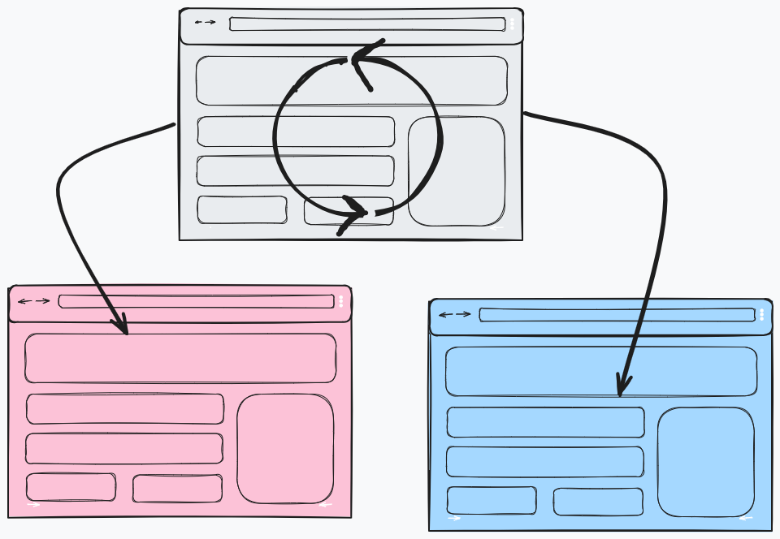

# Desenvolvimento Web Enxuto 🌐🧽

O Desenvolvimento Web Enxuto é um movimento que preza pelo domínio de conhecimentos básicos para desenvolver interfaces de usuário de modo simples, porém robusto para a web. Em outras palavras, esse movimento busca priorizar HTML e CSS, em detrimento de bibliotecas e frameworks JavaScript, reduzindo a quantidade de dependências nos projetos.

## O Poder do HTML 👊🦸

O HTML5 (HyperText Markup Language 5) é uma linguagem de marcação que permite a interação [_hipermídia_](https://htmx.org/essays/when-to-use-hypermedia/), isto é, a construção de páginas com hipertexto e multimídia. 

Para esclarecer, hipertexto é a leitura não linear de arquivos de texto. Já multimídia é o conjunto de diferentes tipos de mídia disponíveis na web, como arquivos de áudio e de vídeo. Nesse sentido, a hipermídia obtém êxito no atendimento da maioria das necessidades dos sistemas para web, pois é descomplicada, otimizável e dá mais liberdade à escolha de tecnologias para o server-side.

Apesar disso, existe uma discussão sobre a escolha entre a hipermídia e um [SPA](#single-page-applicationtions---spas) (Single-page Applicationtion). Tal decisão depende das singularidades de cada projeto, todavia o movimento em questão defende que a hipermídia é suficiente para grande parte dos problemas solucionados com sistemas web.

Dentre as principais motivações para optar pela hipermídia, estão: 
- A interface de usuário é composta por texto e imagens predominantemente;
- A interface consiste em formulários que devem ser preenchidos e ter seus dados armazenados em bancos de dados.
- A UI (interface de usuário) tem atualizações aninhadas, ocorrendo em blocos definidos. 
- A página precisa de deep-links – links que direcionam para um conteúdo específico dentro de uma página.

No entanto, utilizar somente a hipermídia pode não ser uma boa ideia nos seguintes casos: 
- A UI tem muitas dependências dinâmicas, isto é, dependência de informações que não podem ser determinadas na renderização, no server-side;
- O sistema precisa ser totalmente funcional quando offline. 
- A UI é atualizada com extrema frequência.
- É necessária a integração com componentes _copy & paste_, que, aliás, são projetados para frameworks frontend específicos.

Nessa perspectiva, surge então o [HATEOAS](https://htmx.org/essays/hateoas/) (Hypermedia as the Engine of Application State), que é um tipo de arquitetura de API REST. Nela, clintes da API podem fazer seu consumo por meio de links (hipermídia), sem ter conhecimento prévio sobre ela.

### Single-page Applications - SPAs

Um SPA é um modelo de implementação que carrega apenas um documento web e que, quando precisa mostrar um conteúdo diferente, atualiza o body desse único documento via APIs JavaScript, como o [Fetch](https://developer.mozilla.org/en-US/docs/Web/API/Fetch_API). A vantagem disso é que usuários podem usar sites sem precisar carregar páginas vindas do servidor, o que gera performance e uma experiência mais dinâmica.

Contudo, o SPA também apresenta alguns pontos negativos que devem ser levados em consideração, por exemplo:
- Demanda frameworks JavaScript muito carregados;
- Nem sempre a performance é beneficiada;
- Pode haver muitos bugs; e
- Apresenta problemas de acessibilidade, dentre outros entraves.

Vale citar aqui os principais frameworks que permitem a implementação de SPAs:
- [React](https://react.dev/): biblioteca JavaScript para criação de componentes de UI, tanto para apps nativos (designados para um tipo específico de sistema operacional), quanto web.
- [Angular](https://angular.dev/guide/routing/router-tutorial): é uma plataforma, desenvolvida em typeScript, mantida pela Google. Oferece base de componentes para aplicações web escaláveis, várias bibliotecas e ferramentas que auxiliam a codificação.
- [Vue](https://vuejs.org/guide/extras/ways-of-using-vue#single-page-application-spa): é um framework JavaScript para UIs. Suas principais features são: renderização declarativa e reatividade (sobre alterações de estado JS).
- [Vite](https://vite.dev/guide/why.html): é uma ferramenta de build que busca agilizar a inicialização do servidor de desenvolvimento. Permite a separação de programas JS em módulos reutilizáveis, faz transpilação de TS para JS, é mais simples e rápido do que o [Webpack](https://webpack.js.org/), é independente de outros frameworks.

### Multi-page Applications - MPAs

MPA é um modelo de implementação de sistemas web que faz um carregamento completo da página a cada requisição.

Diferenciais de um MPA:
- Melhor implementação de técnicas de SEO;
- Carregamento ágil na inicialização;
- Oferece maior facilidade para manutenção e escalabilidade. 

Convém listar ainda algumas desvantagens dos MPAs:
- Não é possível rodar vídeos de forma ininterrupta.
- Botão de voltar e scroll infinito não são viáveis.
- As bibliotecas JavaScript são recarregadas a cada requisição.
- Geralmente, apresentam problemas de latência.

Nesse sentido, [SSR](https://www.patterns.dev/react/server-side-rendering/) (Server-Side Rendering) é uma alternativa para renderização de conteúdo web. Ele gera todo o HTML para que a página seja renderizada em resposta a uma requisição (do usuário). A maior parte das coisas como conexões e fetchs são resolvidas no server-side, inclusive o HTML para formatar o conteúdo a ser exibido, para que posteriormente possa ser enviado ao client-side.